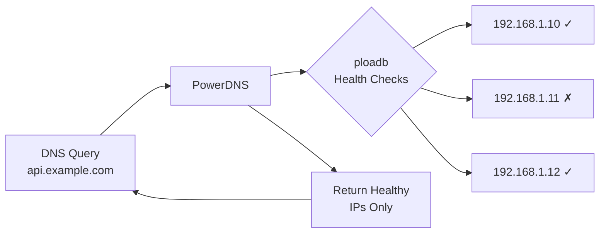

# PowerDNS Load Balancer - Documentation Index

Complete documentation for the PowerDNS Load Balancer (`ploadb`) project.

## 📋 Documentation Overview

This project provides a DNS-based load balancer that monitors multiple IP addresses for DNS A records and automatically enables/disables them based on ICMP ping health checks.

## 📚 Documentation Files

### 🚀 [Quick Start Guide](QUICKSTART.md)
**Get running in 5 minutes!**
- Prerequisites checklist
- 5-minute setup process
- Basic testing and verification
- Common troubleshooting

### 📖 [Complete User Guide](README.md)
**Comprehensive overview and usage**
- Features and architecture overview
- Detailed installation instructions
- Configuration reference
- Usage examples and monitoring
- Troubleshooting guide

### 🔧 [Installation Guide](INSTALLATION.md)
**Step-by-step installation**
- System requirements
- PowerDNS configuration
- Building from source
- Service setup and verification
- Security hardening

### ⚙️ [Configuration Reference](CONFIGURATION.md)
**Detailed configuration options**
- Configuration file format
- PowerDNS integration settings
- Service parameters
- Performance tuning
- Security considerations

### 🏗️ [Architecture & API Reference](ARCHITECTURE.md)
**Technical deep dive**
- System architecture
- Code structure and functions
- PowerDNS API integration
- Health checking implementation
- Extension points

## 🔍 What This Project Does



### Key Features
- **Automatic Health Monitoring**: ICMP ping-based health checks
- **DNS Integration**: Uses PowerDNS HTTP API for updates
- **High Availability**: Automatic failover and recovery
- **Service Integration**: Runs as Linux systemd service
- **Concurrent Processing**: Handles multiple zones simultaneously

## 🎯 Quick Navigation

### New Users
1. **[Quick Start Guide](QUICKSTART.md)** - Get running immediately
2. **[README](README.md)** - Understand the full system
3. **[Installation Guide](INSTALLATION.md)** - Production setup

### Administrators
1. **[Configuration Reference](CONFIGURATION.md)** - Tuning and optimization
2. **[Architecture Reference](ARCHITECTURE.md)** - Understanding internals
3. **[Troubleshooting](README.md#troubleshooting)** - Common issues

### Developers
1. **[Architecture Reference](ARCHITECTURE.md)** - Code structure
2. **[API Integration](ARCHITECTURE.md#api-integration-details)** - PowerDNS API
3. **[Extension Points](ARCHITECTURE.md#extension-points)** - Customization

## 📋 Project Structure

```
pdnsloadbalancer/
├── README.md              # Complete user guide
├── QUICKSTART.md          # 5-minute setup guide  
├── INSTALLATION.md        # Detailed install instructions
├── CONFIGURATION.md       # Configuration reference
├── ARCHITECTURE.md        # Technical deep dive
├── DOCS.md               # This documentation index
├── ploadb/
│   ├── ploadb.go         # Main application source
│   ├── etc/ploadb.conf   # Configuration template
│   └── ploadb            # Compiled binary
├── etc/systemd/system/
│   └── ploadb.service    # Systemd service definition
├── go.mod                # Go dependencies
├── *.sh                  # Testing utilities
└── *.json               # Example data structures
```

## ⚡ Example Use Cases

### 1. Web Server Load Balancing
```
web.example.com → [192.168.1.10, 192.168.1.11, 192.168.1.12]
```
Automatically removes failed web servers from DNS responses.

### 2. API Endpoint High Availability  
```
api.example.com → [10.0.1.100, 10.0.1.101, 10.0.1.102]
```
Ensures API clients always get working endpoints.

### 3. Database Connection Failover
```
db.example.com → [192.168.1.50, 192.168.1.51]
```
Provides automatic database failover via DNS.

## 🔧 System Requirements

- **OS**: Linux with systemd
- **Runtime**: Go 1.24+ 
- **Dependencies**: PowerDNS with HTTP API
- **Privileges**: Root access for ICMP ping
- **Network**: Connectivity to monitored hosts

## 📊 Performance Characteristics

- **Health Check Interval**: 20 seconds (configurable)
- **Ping Timeout**: 5 seconds
- **Concurrent Processing**: All checks run in parallel
- **Resource Usage**: Minimal CPU/memory footprint
- **Scalability**: Linear with number of monitored IPs

## 🔒 Security Features

- **API Authentication**: PowerDNS API key protection
- **Privilege Management**: Minimal required permissions
- **Network Security**: Configurable API access restrictions
- **Log Security**: Secure log file permissions

## 🚨 Important Notes

### ⚠️ Health Check Method
- Uses **ICMP ping only** (3 packets per IP)
- Requires root privileges or `cap_net_raw` capability
- May not detect application-level failures

### ⚠️ DNS Record Requirements  
- Only monitors **A records** with **multiple IP addresses**
- Single-IP records and other record types are ignored
- Changes affect DNS responses immediately

### ⚠️ Network Dependencies
- Requires network connectivity to PowerDNS API
- Needs ICMP access to all monitored hosts
- Firewall rules may affect functionality

## 📞 Support and Troubleshooting

### Quick Diagnostics
```bash
# Check service status
sudo systemctl status ploadb

# Monitor activity 
sudo tail -f /var/log/ploadb/ploadb.log

# Test API connectivity
curl -H 'X-API-Key: your-key' http://localhost:8081/api/v1/servers
```

### Common Issues
- **Permission denied**: Set ICMP capabilities with `setcap`
- **API connection failed**: Check PowerDNS configuration and connectivity
- **No monitoring**: Verify A records have multiple IPs
- **Service start failure**: Check logs and configuration file

### Getting Help
1. **Check logs** first: `/var/log/ploadb/ploadb.log`
2. **Review configuration**: Verify TOML syntax and values
3. **Test connectivity**: PowerDNS API and ICMP to monitored hosts
4. **Consult documentation**: Specific guides for your issue

## 🎉 Success Indicators

You'll know the system is working when:

- ✅ Service shows as "active (running)" in systemd
- ✅ Logs show regular zone processing activity
- ✅ DNS queries return only healthy IP addresses
- ✅ Failed hosts are automatically excluded from responses
- ✅ Recovered hosts are automatically re-included

---

**Ready to get started?** 👉 Begin with the [Quick Start Guide](QUICKSTART.md) 