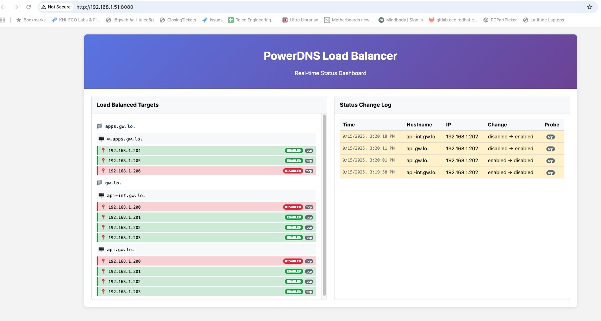

# PowerDNS Load Balancer (ploadb)

A DNS-based load balancer service that monitors multiple IP addresses for DNS A records and automatically enables/disables them based on configurable health checks (ping, HTTP, or HTTPS). This service integrates with PowerDNS via its HTTP API to provide automatic failover and load distribution at the DNS level.

## Overview

The PowerDNS Load Balancer (`ploadb`) is designed to run as a Linux systemd service alongside PowerDNS (pdns) and PowerDNS Recursor. It continuously monitors DNS zones for A records with multiple IP addresses, performs configurable health checks (ping, HTTP, or HTTPS), and dynamically updates the DNS records to disable unreachable hosts and re-enable them when they come back online.

## Features

- **Configurable Health Monitoring**: Multiple probe types - ICMP ping, HTTP, and HTTPS health checks
- **Per-Record Configuration**: Individual health check settings for each DNS record using JSON comments
- **Dynamic DNS Updates**: Real-time enabling/disabling of DNS records based on host availability
- **PowerDNS Integration**: Uses PowerDNS HTTP API for seamless zone updates
- **Service Integration**: Runs as a proper Linux systemd service
- **Enhanced Logging**: Comprehensive logging with probe type information and automatic rotation
- **Configuration Management**: Simple TOML-based service configuration with JSON probe settings
- **Concurrent Processing**: Handles multiple zones and records concurrently
- **Backward Compatibility**: Existing ping-based configurations continue to work unchanged

## Architecture

```
┌─────────────────┐    ┌──────────────────┐    ┌─────────────────┐
│   ploadb        │    │    PowerDNS      │    │   DNS Clients   │
│   Service       │◄──►│    HTTP API      │◄──►│                 │
│                 │    │                  │    │                 │
│ • Health Checks │    │ • Zone Management│    │ • DNS Queries   │
│ • Record Updates│    │ • Record Storage │    │ • Load Balanced │
│ • Probe Config  │    │ • API Endpoints  │    │   Responses     │
│ • Logging       │    │ • Comment Storage│    │                 │
└─────────────────┘    └──────────────────┘    └─────────────────┘
         │
         ▼
┌─────────────────┐
│  Target Hosts   │
│                 │
│ • IP: 192.168.1.200 ◄─── ICMP Ping
│ • IP: 192.168.1.201 ◄─── HTTP/HTTPS Checks
│ • IP: 192.168.1.202 ◄─── Configurable Probes
│ • IP: 192.168.1.203 ◄─── Every 20s
└─────────────────┘
```

## How It Works

1. **Zone Discovery**: Every 20 seconds, `ploadb` queries PowerDNS API to get all managed zones
2. **Record Analysis**: For each zone, it examines all A records and identifies those with multiple IP addresses
3. **Probe Configuration**: Parses JSON configuration from record comments to determine health check type
4. **Health Checking**: Performs the configured health check type (ping, HTTP, or HTTPS) for each IP
5. **State Management**: Based on probe results, it determines if each IP should be enabled or disabled
6. **DNS Updates**: When state changes are detected, it updates the PowerDNS zone via API calls
7. **Enhanced Logging**: All state changes are logged with timestamps and probe type information

## Installation

### Prerequisites

- PowerDNS with HTTP API enabled
- Go 1.24.2 or later
- Linux system with systemd
- Root or appropriate privileges for ICMP ping

### Building from Source

```bash
# Clone or copy the project files
cd /path/to/pdnsloadbalancer

# Build the binary
cd ploadb
go build -o ploadb ploadb.go

# Copy binary to appropriate location
sudo cp ploadb /usr/local/bin/
# or copy to the path specified in the systemd service file
sudo cp ploadb /root/go/src/github.com/ploadb/
```

### Configuration

1. **Create configuration file**:
```bash
sudo mkdir -p /etc
sudo cp ploadb/etc/ploadb.conf /etc/ploadb.conf
```

2. **Edit configuration** (`/etc/ploadb.conf`):
```toml
# PowerDNS API Configuration
Baseurl = "http://your-pdns-server:8081"
ApiPassword = "your-api-key-here"
```

## Health Check Configuration

The service now supports configurable health checks per DNS record using JSON configuration stored in PowerDNS record comments.

### Probe Types

#### ICMP Ping (Default)
```json
{"type": "ping", "timeout": 5}
```
- Uses 3 ICMP ping packets
- Default behavior if no comment is provided
- Requires root or `cap_net_raw` capability

#### HTTP Health Check
```json
{"type": "http", "path": "/health", "port": 8080, "timeout": 10, "expected": 200}
```
- Makes HTTP GET request to specified path
- Configurable port, path, timeout, and expected status code
- Default port: 80

#### HTTPS Health Check
```json
{"type": "https", "path": "/api/status", "port": 443, "timeout": 5, "expected": 200}
```
- Makes HTTPS GET request to specified path
- Certificate verification is disabled for simplicity
- Configurable port, path, timeout, and expected status code
- Default port: 443

#### TCP Health Check
```json
{"type": "tcp", "port": 6443, "timeout": 10}
```
- Attempts TCP socket connection to specified port
- Port number is required (1-65535)
- Configurable timeout in seconds
- Use cases: API servers, databases, SSH services

### Configuration Parameters

| Parameter | Type | Default | Description |
|-----------|------|---------|-------------|
| `type` | string | "ping" | Probe type: "ping", "http", "https", or "tcp" |
| `path` | string | "/" | HTTP(S) endpoint path |
| `port` | int | 80/443/required | Port number (80 for HTTP, 443 for HTTPS, required for TCP) |
| `timeout` | int | 5 | Timeout in seconds |
| `expected` | int | 200 | Expected HTTP status code |

### Setting Up Health Checks

Configure health checks by adding JSON to PowerDNS record comments:

```bash
# Example: HTTP health check on port 8080
curl -X PATCH http://localhost:8081/api/v1/servers/localhost/zones/example.com \
  -H "X-API-Key: your-api-key" \
  -H "Content-Type: application/json" \
  -d '{
    "rrsets": [{
      "name": "api.example.com",
      "type": "A",
      "changetype": "REPLACE",
      "records": [
        {"content": "10.0.1.10", "disabled": false},
        {"content": "10.0.1.11", "disabled": false}
      ],
      "comment": "{\"type\":\"http\",\"path\":\"/health\",\"port\":8080,\"timeout\":10,\"expected\":200}"
    }]
  }'
```

3. **Set up logging directory**:
```bash
sudo mkdir -p /var/log/ploadb
sudo chown root:root /var/log/ploadb
sudo chmod 755 /var/log/ploadb
```

4. **Install systemd service**:
```bash
sudo cp etc/systemd/system/ploadb.service /etc/systemd/system/
sudo systemctl daemon-reload
```

### PowerDNS Configuration

Ensure PowerDNS is configured with API access enabled. In your `pdns.conf`:

```ini
# Enable the built-in webserver
webserver=yes
webserver-address=0.0.0.0
webserver-port=8081

# Enable the API
api=yes
api-key=your-api-key-here

# Allow API access (adjust IP ranges as needed)
webserver-allow-from=127.0.0.1,192.168.0.0/16
```

## Web GUI Dashboard

PowerDNS Load Balancer includes a built-in web dashboard for monitoring health check status in real-time. The GUI provides:

- **Real-time Status**: Live updates of all monitored zones and their health states
- **Visual Indicators**: Color-coded status badges (ENABLED/DISABLED) for each IP address
- **Detailed Information**: Shows last check times, probe types, and configuration details
- **Sorted Display**: IP addresses are displayed in numerical order for easy reading
- **Auto-refresh**: WebSocket connection provides instant updates without page refresh

### Accessing the GUI

The web interface is available at `http://localhost:8080` by default. The port can be configured in `/etc/ploadb.conf`:

```toml
WebPort = "8080"  # Default web GUI port
```

### GUI Features



The dashboard displays:
- **Zone Organization**: Zones are grouped and clearly labeled with folder icons
- **Hostname Grouping**: Each hostname shows all associated IP addresses
- **Status Badges**: Green "ENABLED" and red "DISABLED" badges for quick status identification
- **Timestamps**: Last health check time for each IP address
- **Probe Types**: Displays the type of health check being performed (ping, http, https, tcp)
- **Live Updates**: Real-time status changes via WebSocket connection

### Service Management via GUI

While the GUI is read-only for monitoring, it provides comprehensive visibility into:
- Current health status of all monitored endpoints
- Historical state changes and timing information
- Active probe configurations for each record
- Overall system health at a glance

For configuration changes, continue to use the PowerDNS API directly as shown in the examples below.

## Usage

### Service Management

```bash
# Enable and start the service
sudo systemctl enable ploadb
sudo systemctl start ploadb

# Check service status
sudo systemctl status ploadb

# View logs
sudo journalctl -u ploadb -f

# Stop the service
sudo systemctl stop ploadb

# Restart the service
sudo systemctl restart ploadb
```

### Manual Execution

For testing or debugging:

```bash
# Run in foreground
sudo /usr/local/bin/ploadb

# Install as service
sudo /usr/local/bin/ploadb install

# Start service
sudo /usr/local/bin/ploadb start

# Stop service
sudo /usr/local/bin/ploadb stop
```

### Monitoring and Logs

Logs are written to `/var/log/ploadb/ploadb.log` with automatic rotation:
- Maximum file size: 5 MB
- Keep 3 backup files
- Rotate files older than 28 days
- Compress old log files

Example log entries:
```
2024/01/15 10:30:15 api-int.gw.lo. - 192.168.1.201 changed state from enabled to disabled (ping probe)
2024/01/15 10:30:35 api-int.gw.lo. - 192.168.1.201 changed state from disabled to enabled (ping probe)
2024/01/15 10:31:15 web.example.com. - 10.0.1.10 changed state from disabled to enabled (http probe)
2024/01/15 10:31:35 secure-api.example.com. - 10.0.1.20 changed state from enabled to disabled (https probe)
```

## Configuration Reference

### Configuration File (`/etc/ploadb.conf`)

| Parameter | Description | Example |
|-----------|-------------|---------|
| `Baseurl` | PowerDNS API base URL | `"http://localhost:8081"` |
| `ApiPassword` | PowerDNS API key | `"your-secret-api-key"` |

### DNS Record Requirements

For load balancing to work, DNS A records must have:
- **Multiple IP addresses** (2 or more)
- **Type A records only** (AAAA, CNAME, etc. are ignored)
- **Proper zone configuration** in PowerDNS

Example DNS zone configurations:

**Ping Health Check (Default):**
```json
{
  "name": "db.example.com.",
  "type": "A",
  "ttl": 300,
  "records": [
    {"content": "192.168.1.10", "disabled": false},
    {"content": "192.168.1.11", "disabled": false},
    {"content": "192.168.1.12", "disabled": false}
  ]
}
```

**HTTP Health Check:**
```json
{
  "name": "api.example.com.",
  "type": "A",
  "ttl": 300,
  "records": [
    {"content": "192.168.1.20", "disabled": false},
    {"content": "192.168.1.21", "disabled": false}
  ],
  "comment": "{\"type\":\"http\",\"path\":\"/health\",\"port\":8080,\"timeout\":5,\"expected\":200}"
}
```

**HTTPS Health Check:**
```json
{
  "name": "secure-api.example.com.",
  "type": "A",
  "ttl": 300,
  "records": [
    {"content": "192.168.1.30", "disabled": false},
    {"content": "192.168.1.31", "disabled": false}
  ],
  "comment": "{\"type\":\"https\",\"path\":\"/status\",\"port\":443,\"timeout\":10,\"expected\":200}"
}
```

### Real-World Production Examples

These examples show actual configurations from production gw.lo and apps.gw.lo zones:

#### Kubernetes API Load Balancing with TCP Health Checks

```bash
# Kubernetes control plane nodes with TCP port 6443 health checks
curl -X PATCH http://192.168.1.51:8081/api/v1/servers/localhost/zones/gw.lo. \
  -H "X-API-Key: quest.5124" \
  -H "Content-Type: application/json" \
  -d '{
    "rrsets": [{
      "name": "api.gw.lo.",
      "type": "A",
      "changetype": "REPLACE",
      "records": [
        {"content": "192.168.1.201", "disabled": false},
        {"content": "192.168.1.202", "disabled": false},
        {"content": "192.168.1.203", "disabled": false},
        {"content": "192.168.1.200", "disabled": true},
        {"content": "192.168.1.168", "disabled": true}
      ],
      "comments": [{"content": "{\"type\":\"tcp\",\"port\":6443,\"timeout\":10}", "account": ""}],
      "ttl": 86400
    }]
  }'
```

**Current Status**: 3 active control plane nodes (192.168.1.201-203), 2 disabled nodes

#### Application Ingress Load Balancing with TCP Health Checks

```bash
# OpenShift/Kubernetes worker nodes serving HTTP traffic on port 80
curl -X PATCH http://192.168.1.51:8081/api/v1/servers/localhost/zones/apps.gw.lo. \
  -H "X-API-Key: quest.5124" \
  -H "Content-Type: application/json" \
  -d '{
    "rrsets": [{
      "name": "*.apps.gw.lo.",
      "type": "A",
      "changetype": "REPLACE",
      "records": [
        {"content": "192.168.1.204", "disabled": false},
        {"content": "192.168.1.205", "disabled": false},
        {"content": "192.168.1.206", "disabled": false}
      ],
      "comments": [{"content": "{\"type\":\"tcp\",\"port\":80,\"timeout\":5}", "account": ""}],
      "ttl": 100
    }]
  }'
```

**Current Status**: 3 active worker nodes handling wildcard application routing

#### Mixed Health Check Types in Same Zone

```bash
# Individual control plane nodes with TCP health checks on API port
curl -X PATCH http://192.168.1.51:8081/api/v1/servers/localhost/zones/gw.lo. \
  -H "X-API-Key: quest.5124" \
  -H "Content-Type: application/json" \
  -d '{
    "rrsets": [
      {
        "name": "control0.gw.lo.",
        "type": "A",
        "changetype": "REPLACE",
        "records": [{"content": "192.168.1.201", "disabled": false}],
        "comments": [{"content": "{\"type\":\"tcp\",\"port\":6443,\"timeout\":10}", "account": ""}],
        "ttl": 86400
      },
      {
        "name": "worker0.gw.lo.",
        "type": "A",
        "changetype": "REPLACE",
        "records": [{"content": "192.168.1.204", "disabled": false}],
        "ttl": 86400
      }
    ]
  }'
```

**Result**: control0 gets TCP health checks, worker0 uses default ping health checks

#### TCP Health Check Configuration

TCP health checks were added in version 2.1 and provide simple port connectivity testing:

```json
{"type": "tcp", "port": 22, "timeout": 5}
```

- **Port Requirement**: Must specify a valid port (1-65535)
- **Connection Test**: Attempts TCP socket connection to specified port
- **Timeout Support**: Configurable connection timeout (default 5 seconds)
- **Use Cases**: Database connections, SSH services, API endpoints, Kubernetes API servers

**TCP Configuration Parameters:**

| Parameter | Type | Required | Description |
|-----------|------|----------|-------------|
| `type` | string | Yes | Must be "tcp" |
| `port` | int | Yes | Port number (1-65535) |
| `timeout` | int | No | Timeout in seconds (default 5) |

**TCP Probe Examples:**
```bash
# SSH service monitoring
"comment": "{\"type\":\"tcp\",\"port\":22}"

# Database connectivity
"comment": "{\"type\":\"tcp\",\"port\":5432,\"timeout\":10}"

# Kubernetes API server
"comment": "{\"type\":\"tcp\",\"port\":6443,\"timeout\":10}"
```

## Testing

### Test Scripts

The project includes several test scripts:

1. **`getit.sh`** - Retrieve specific zone information
2. **`getzones.sh`** - List all zones
3. **`test.sh`** - Test DNS updates and query resolution

### Manual Testing

```bash
# Test API connectivity
curl -H 'X-API-Key: your-api-key' http://your-pdns:8081/api/v1/servers/localhost/zones

# Test DNS resolution
nslookup your-load-balanced-record.example.com your-dns-server

# Monitor real-time logs
sudo tail -f /var/log/ploadb/ploadb.log
```

### Health Check Testing

To test the health checking mechanism:

#### Ping Probe Testing
1. **Simulate host failure**: Block ICMP on one of the target hosts
   ```bash
   # On target host, block ICMP
   sudo iptables -A INPUT -p icmp --icmp-type echo-request -j DROP
   ```
2. **Watch logs**: Monitor for ping probe failures
3. **Restore connectivity**: Remove ICMP block
   ```bash
   sudo iptables -D INPUT -p icmp --icmp-type echo-request -j DROP
   ```

#### HTTP/HTTPS Probe Testing
1. **Simulate service failure**: Stop the web service on one target host
   ```bash
   # Stop web service
   sudo systemctl stop nginx  # or apache2, or your web service
   ```
2. **Watch logs**: Monitor for HTTP/HTTPS probe failures
3. **Test different responses**: Configure service to return different status codes
4. **Restore service**: Restart the web service
   ```bash
   sudo systemctl start nginx
   ```

#### General Testing Steps
1. **Monitor logs**: Watch `/var/log/ploadb/ploadb.log` for state changes
2. **Verify DNS**: Query the DNS record to confirm failed hosts are removed
   ```bash
   nslookup your-record.example.com your-dns-server
   ```
3. **Test probe configuration**: Verify probe type is logged correctly

## Troubleshooting

### Common Issues

1. **Permission Denied for ICMP**
   ```
   Solution: Run as root or set appropriate capabilities:
   sudo setcap cap_net_raw=+ep /usr/local/bin/ploadb
   ```

2. **API Connection Failed**
   ```
   Check: PowerDNS API configuration and network connectivity
   Test: curl -H 'X-API-Key: key' http://pdns-server:8081/api/v1/servers
   ```

3. **No Records Being Monitored**
   ```
   Verify: DNS records have multiple IP addresses and are type A
   Check: Zone configuration in PowerDNS
   ```

4. **Service Won't Start**
   ```
   Check: Binary path in systemd service file
   Verify: Configuration file exists and is readable
   Review: systemctl status ploadb and journalctl -u ploadb
   ```

5. **HTTP/HTTPS Probe Failures**
   ```
   Check: Target service is running on configured port
   Test: curl http://target-ip:port/path manually
   Verify: Expected HTTP status code is correct
   Review: Timeout settings are appropriate for your service
   ```

6. **Invalid Probe Configuration**
   ```
   Verify: JSON syntax is correct in record comments
   Check: Probe type is "ping", "http", or "https"
   Test: Configuration falls back to ping on errors
   Review: Logs for JSON parsing errors
   ```

7. **HTTPS Certificate Issues**
   ```
   Note: Certificate verification is disabled by default
   Check: Target HTTPS service is accessible
   Test: curl -k https://target-ip:port/path manually
   ```

### Debug Mode

Enable debug logging by uncommenting debug lines in the source code and rebuilding:

```go
// Uncomment these lines in ploadb.go for detailed output
fmt.Printf("Response Info: %s\n", resp.String())
fmt.Printf("Status Code: %d\n", resp.StatusCode())
```

## API Integration

### PowerDNS API Endpoints Used

- `GET /api/v1/servers/localhost/zones` - List all zones
- `GET /api/v1/servers/localhost/zones/{zone}` - Get zone details
- `PATCH /api/v1/servers/localhost/zones/{zone}` - Update zone records

### Data Structures

The service works with PowerDNS API JSON structures:

```json
{
  "rrsets": [{
    "name": "api.example.com.",
    "type": "A", 
    "changetype": "replace",
    "records": [
      {"content": "192.168.1.10", "disabled": false},
      {"content": "192.168.1.11", "disabled": true}
    ]
  }]
}
```

## Dependencies

### Go Modules

- `github.com/BurntSushi/toml` - Configuration file parsing
- `github.com/go-resty/resty` - HTTP client for API calls
- `github.com/kardianos/service` - Cross-platform service management
- `github.com/oilbeater/go-ping` - ICMP ping implementation
- `github.com/tidwall/gjson` - JSON parsing and querying
- `github.com/tidwall/sjson` - JSON modification
- `gopkg.in/natefinch/lumberjack.v2` - Log rotation

### System Requirements

- Linux with systemd
- PowerDNS server with API enabled
- Network connectivity to target hosts
- ICMP ping capabilities

## Security Considerations

- **API Key Protection**: Store PowerDNS API keys securely
- **Network Access**: Limit API access to trusted networks
- **Service Isolation**: Run service with minimal required privileges
- **Log Security**: Protect log files from unauthorized access

## Performance

### Timing Configuration

- **Health Check Interval**: 20 seconds (configurable in code)
- **Ping Probes**: 3 packets per IP, 5-second default timeout
- **HTTP/HTTPS Probes**: Configurable timeout per probe (default 5 seconds)
- **Sequential Processing**: Probes executed sequentially per record for reliability

### Scalability

The service is designed to handle:
- Multiple DNS zones simultaneously
- Multiple A records per zone
- Multiple IP addresses per A record
- Concurrent health checks for all monitored IPs

## Changelog

### Version 2.0 (2025-09-15) - Configurable Health Probes
- **New Feature**: Added support for HTTP and HTTPS health checks
- **Enhancement**: Per-record probe configuration using JSON comments
- **Improvement**: Enhanced logging with probe type information
- **Compatibility**: Full backward compatibility with existing ping-based configurations
- **Configuration**: New probe types support custom paths, ports, timeouts, and expected status codes

### Version 1.0 (Original) - ICMP Ping Health Checks
- Initial implementation with ICMP ping health checking
- PowerDNS API integration for zone management
- Automatic DNS record enable/disable functionality
- Systemd service integration and log rotation

## Contributing

To contribute to this project:

1. Fork the repository
2. Create a feature branch
3. Make your changes
4. Test thoroughly with all probe types
5. Submit a pull request

## License

GPL Version 3
See gpl-3.0.txt included in this repo.

## Support

For issues and questions:
- Check the troubleshooting section above
- Review log files in `/var/log/ploadb/`
- Verify PowerDNS API connectivity
- Test network connectivity to monitored hosts 
